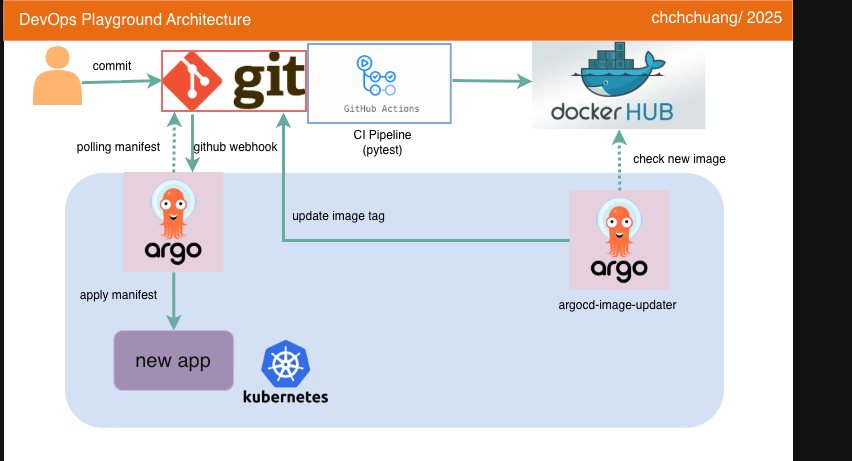

# DevOps Playground - CI/CD MVP

>* 這是一個用 Python FastAPI、Docker、Kubernetes、Helm、GitHub Actions、ArgoCD 架設的完整 CI/CD MVP 專案
>* 展示從開發到生產部署的完整 DevOps 流程，包含自動化測試、容器化部署、Kubernetes 編排和 GitOps 工作流程

## Architecture Diagram 架構圖



## Prerequisites 使用環境
* 後端: [Python FastAPI](https://fastapi.tiangolo.com/) (Python 3.13)
* 套件管理: [uv](https://github.com/astral-sh/uv)
* 容器化: [Docker](https://www.docker.com/)
* 編排: [Kubernetes](https://kubernetes.io/) + [Helm](https://helm.sh/)
* CI/CD: [GitHub Actions](https://github.com/features/actions)
* GitOps: [ArgoCD](https://argo-cd.readthedocs.io/) + [GitHub Webhook](https://docs.github.com/en/webhooks/about-webhooks)
* 測試: [pytest](https://pytest.org/)
* 本地開發: [Kind](https://kind.sigs.k8s.io/) (Kubernetes in Docker)

## Project Structure 專案結構

```
DevOps-playground/
├── main.py                   # FastAPI 應用程式主檔案
├── test_main.py              # 單元測試
├── Dockerfile                # Docker 映像建置檔案
├── pyproject.toml            # Python 專案配置
├── uv.lock                   # 依賴鎖定檔案
├── kind-config.yml           # Kind 叢集配置
├── argocd-application.yml    # ArgoCD 應用程式配置
├── argocd-cm-patch.yml       # ArgoCD ConfigMap patch
├── .github/workflows/        # GitHub Actions CI/CD 流程
│   └── ci.yml
└── devops-playground/        # Helm Chart
    ├── Chart.yaml
    ├── values.yaml
    └── templates/
        ├── deployment.yaml
        ├── service.yaml
        ├── ingress.yaml
        └── ...
```

## CI/CD 流程

本專案分為 CI (持續整合) 和 CD (持續部署) 兩大流程。

### 1. CI 流程：功能開發與測試

> 由 Pull Request 或 Push 到 `main` 分支時觸發

1. **開發者**：建立新分支並修改程式碼
2. **提交 PR**：推送分支並建立 Pull Request
3. **自動化測試**：GitHub Actions 執行：
   - Checkout 程式碼
   - 安裝 Python 依賴 (`uv`)
   - 執行 `pytest` 測試
4. **合併**：測試通過後合併到 `main` 分支

### 2. CD 流程：版本發布與部署

> 由建立 Git 標籤時觸發

#### 步驟 A：觸發新版本 (手動)

```bash
# 確保 main 分支為最新
git checkout main
git pull origin main

# 建立並推送版本標籤
git tag v1.1.0
git push origin v1.1.0
```

**GitHub Actions 自動執行：**
- 登入 Docker Hub
- 建置並標記 Docker 映像 (`underdog22a/devops-playground:v1.1.0`)
- 推送 image 到 Docker Hub

#### 步驟 B：GitOps 自動部署 (全自動)

1. **ArgoCD Image Updater** 偵測到 image 更新
2. **自動更新 Manifests**：更新 `devops-playground/values.yaml` 中的image 標籤
3. **觸發 Webhook**：GitHub Webhook 通知 ArgoCD 配置變更
4. **ArgoCD 同步**：自動執行 `helm upgrade` 更新 K8s Deployment
5. **部署完成**：應用程式自動更新到新版本

> **備註**：若未收到 Webhook，ArgoCD 仍會每 3 分鐘進行定期同步確認

## Authors 關於作者
* Author: **chchchuang**  
* Update: 2025-10-23  
* Contact: chchchuang@gmail.com

## Reference 參考資料
* [FastAPI 文件](https://fastapi.tiangolo.com/)
* [Kubernetes 文件](https://kubernetes.io/docs/)
* [Helm 文件](https://helm.sh/docs/)
* [ArgoCD 文件](https://argo-cd.readthedocs.io/)
* [GitHub Actions 文件](https://docs.github.com/en/actions)